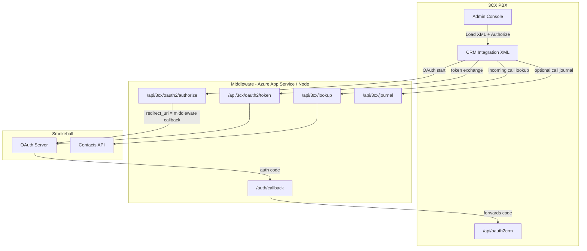

# Smokeball + 3CX Integration Middleware

Node.js middleware that connects **3CX Phone System** to **Smokeball** (Australian legal practice management CRM). It handles OAuth on behalf of the PBX, looks up contacts by phone number for caller ID, and can receive call journal events from 3CX.

---

## Overview

3CX cannot talk to Smokeball directly because:

- Smokeball’s OAuth redirect URI is registered for the **middleware** (e.g. Azure App Service), not each PBX hostname.
- 3CX always sends its own callback URL (`https://<pbx-fqdn>/api/oauth2crm`) during authorization.
- Smokeball has no API to search contacts by phone number.

This app sits in the middle: it proxies OAuth, rewrites redirect URIs, forwards the auth code back to 3CX, and searches Smokeball contacts by phone for caller ID lookup.

---

## Architecture



---

## How OAuth works (proxy mode — recommended)

**Proxy mode** (`SMOKEBALL_OAUTH_MODE=proxy`) is the default and matches a Smokeball app registered with the **middleware callback URL**.

| Step | Who | What happens |
|------|-----|----------------|
| 1 | User in 3CX | Clicks **Authorize** on the CRM integration |
| 2 | 3CX | Opens `{MiddlewareUrl}/api/3cx/oauth2/authorize` with `redirect_uri=https://<pbx>/api/oauth2crm` and PKCE `code_challenge` |
| 3 | Middleware | Stores the PBX redirect URL in base64 `state`, sends Smokeball `redirect_uri={MiddlewareUrl}/auth/callback` |
| 4 | Smokeball | User logs in and approves access |
| 5 | Smokeball | Redirects browser to `{MiddlewareUrl}/auth/callback?code=...&state=...` |
| 6 | Middleware | Decodes `state`, redirects browser to `https://<pbx>/api/oauth2crm?code=...&state=...` |
| 7 | 3CX | Exchanges code via `{MiddlewareUrl}/api/3cx/oauth2/token` |
| 8 | Middleware | Rewrites `redirect_uri` in the token request to the middleware callback (must match step 3) |
| 9 | Smokeball | Returns `access_token` and `refresh_token` |
| 10 | 3CX | Stores refresh token; uses access token on subsequent API calls |

### Passthrough mode (alternative)

Set `SMOKEBALL_OAUTH_MODE=passthrough` only if Smokeball’s developer portal registers the **3CX PBX callback** exactly:

`https://<your-pbx-fqdn>/api/oauth2crm`

Use this when you cannot register the middleware URL in Smokeball. The middleware forwards 3CX’s `redirect_uri` unchanged.

---

## Caller ID lookup flow

When a call arrives, 3CX calls the middleware:

```
GET /api/3cx/lookup?number={phone}
Authorization: Bearer {access_token}
```

The middleware:

1. Validates the Bearer token from 3CX.
2. Queries Smokeball `GET /contacts/` with the `Search` parameter (e.g. `phone:*412345678*`) — typically one API call per lookup instead of paging the full contact list.
3. Verifies matches locally on person (`phone`, `phone2`, `cell`) and company (`phone`) using suffix matching (handles different formats).
4. Retries on `429 Too Many Requests` and `5xx` errors with exponential backoff (honors `Retry-After` when present).
5. Returns a JSON payload 3CX expects:

```json
{
  "contacts": [{
    "id": "...",
    "firstName": "...",
    "lastName": "...",
    "company": "...",
    "phone": "...",
    "email": "...",
    "contactUrl": "https://<middleware>/api/3cx/contacts/{id}/open"
  }]
}
```

If no match is found, it returns `{ "contacts": [] }`.

---

## Call journaling

When **Enable Call Journaling** is turned on in 3CX, the PBX POSTs call details to:

```
POST /api/3cx/journal
Authorization: Bearer {access_token}
```

The middleware:

1. Receives call metadata from 3CX (including AI **transcription**, **summary**, **recording URL**, and agent details when available).
2. **Looks up the Smokeball staff member** who handled the call — by `AgentEmail` first, then by `AgentFirstName` + `AgentLastName` via `GET /staff?Search=...`.
3. Creates a **Smokeball task** (`POST /tasks`) assigned to that staff member — **no matter linkage**.
4. Puts full call details (summary, transcription, recording link, contact info) in the task **note**.

Journal **all** call types (inbound, outbound, missed, unanswered), including calls without a matched CRM contact.

### 3CX prerequisites

- Enable **Call Journaling** in the CRM integration settings.
- Ensure each extension has **email** and **name** filled in (used for staff lookup).
- Enable call recording + AI transcription in 3CX for transcript/summary fields to populate.
- Re-upload `3cx_smokeball_template_fixed.xml` if your template predates transcription fields.

### Environment variables

| Variable | Required | Description |
|----------|----------|-------------|
| `JOURNAL_CREATE_TASKS` | No | `true` (default) — create Smokeball tasks; `false` — log only |
| `SMOKEBALL_DEFAULT_STAFF_ID` | Recommended | Fallback Smokeball staff GUID when agent lookup fails |

Confirm your Smokeball OAuth app includes **Tasks** and **Staff** API scopes.

---

## API endpoints

| Method | Path | Purpose |
|--------|------|---------|
| `GET` | `/api/3cx/oauth2/authorize` | OAuth authorize proxy (3CX → Smokeball) |
| `POST` | `/api/3cx/oauth2/token` | OAuth token proxy (3CX ↔ Smokeball) |
| `GET` | `/api/3cx/lookup?number=` | Contact lookup by phone |
| `POST` | `/api/3cx/journal` | Receive call journal events |
| `GET` | `/auth/callback` | OAuth callback (Smokeball → middleware → 3CX) |
| `GET` | `/api/smokeball/contacts` | Debug: list contacts (requires Bearer token) |
| `GET` | `/api/smokeball/contacts/search?phone=` | Debug: search by phone |
| `GET` | `/api/status` | Health check for dashboard |
| `GET` | `/api/logs` | Recent server logs for dashboard |
| `GET` | `/` | Web dashboard |

Legacy paths `/lookup` and `/journal` (without `/api/3cx`) are supported for older templates.

---

## Project structure

```
├── server.js                      # Express entry point
├── .deployment                    # Azure Oryx build during deploy
├── .github/workflows/             # GitHub Actions → Azure App Service
├── 3cx_smokeball_template_fixed.xml   # 3CX CRM template (load into PBX)
├── public/index.html              # Admin dashboard
└── src/
    ├── config.js                  # Environment configuration
    ├── logger.js                  # Winston + in-memory log buffer
    ├── routes/
    │   ├── 3cx.js                 # OAuth proxy, lookup, journal
    │   ├── smokeball.js           # Direct API routes (debug)
    │   └── auth.js                # Legacy info routes
    ├── services/smokeball.js      # Smokeball API client
    └── utils/auth.js              # Bearer token helpers
```

---

## Environment variables

Copy `.env.example` to `.env` for local development.

| Variable | Required | Description |
|----------|----------|-------------|
| `PORT` | No | Local server port (default `3000`) |
| `SMOKEBALL_CLIENT_ID` | Yes | OAuth client ID from Smokeball |
| `SMOKEBALL_CLIENT_SECRET` | Yes | OAuth client secret |
| `SMOKEBALL_API_KEY` | Yes | API key header for Smokeball REST API |
| `SMOKEBALL_AUTH_URL` | Yes | OAuth host only, e.g. `https://datastaging-auth.smokeball.com.au` |
| `SMOKEBALL_API_URL` | Yes | API base URL, e.g. `https://stagingapi.smokeball.com.au` (production: `https://api.smokeball.com.au`) |
| `SMOKEBALL_APP_URL` | No | Web app base for ContactUrl links from 3CX (default `https://app.smokeball.com.au`) |
| `SMOKEBALL_REDIRECT_URI` | Yes | Middleware OAuth callback, e.g. `https://your-app.azurewebsites.net/auth/callback` |
| `SMOKEBALL_OAUTH_MODE` | No | `proxy` (default) or `passthrough` |
| `PUBLIC_URL` | No | Public base URL for logging and dashboard |
| `SMOKEBALL_MAX_RETRIES` | No | Retries on 429/5xx (default `3`) |
| `SMOKEBALL_RETRY_BASE_DELAY_MS` | No | Initial backoff delay in ms (default `500`) |
| `SMOKEBALL_SEARCH_LIMIT` | No | Max contacts returned per search query (default `50`) |
| `JOURNAL_CREATE_TASKS` | No | Create Smokeball tasks from call journal (`true` default) |
| `SMOKEBALL_DEFAULT_STAFF_ID` | Recommended | Fallback staff GUID when 3CX agent lookup fails |

**Never commit `.env`** — it is listed in `.gitignore`.

---

## Deploying for a new client

Use this checklist for each new customer (PBX + Smokeball firm).

### 1. Smokeball developer setup

- [ ] Create (or reuse) an OAuth application in Smokeball’s developer portal.
- [ ] Register the **middleware callback URL** (proxy mode):
  ```
  https://<your-middleware-host>/auth/callback
  ```
- [ ] Note the **Client ID**, **Client Secret**, and **API Key**.
- [ ] Confirm staging vs production URLs:
  - Staging auth: `https://datastaging-auth.smokeball.com.au`
  - Staging API: `https://stagingapi.smokeball.com.au`
  - Production auth: `https://auth.smokeball.com.au`
  - Production API: `https://api.smokeball.com.au`

### 2. Middleware deployment

Choose one deployment per client **or** a shared multi-tenant instance (current design is single-tenant per env vars).

**Option A — Shared middleware (multiple clients, same Smokeball app)**  
Only works if all clients share the same Smokeball OAuth app credentials.

**Option B — Per-client middleware (recommended)**  
Deploy a separate Azure Web App (or App Service instance) per client with their own env vars.

| Setting | What to set |
|---------|-------------|
| Azure Web App | New Linux Node 20 app per client (or separate resource group) |
| `SMOKEBALL_CLIENT_ID` | Client’s Smokeball OAuth client ID |
| `SMOKEBALL_CLIENT_SECRET` | Client’s secret |
| `SMOKEBALL_API_KEY` | Client’s API key |
| `SMOKEBALL_AUTH_URL` | Staging or production auth host |
| `SMOKEBALL_API_URL` | Staging or production API host |
| `SMOKEBALL_REDIRECT_URI` | `https://<this-deployment>/auth/callback` |
| `SMOKEBALL_OAUTH_MODE` | `proxy` |
| `PUBLIC_URL` | `https://<this-deployment>` |

Restart the Web App (or redeploy) after changing application settings.

### 3. 3CX CRM template

Edit `3cx_smokeball_template_fixed.xml` before loading into the PBX:

| XML field | Change to |
|-----------|-----------|
| `Name` | Display name in 3CX (e.g. `Smokeball - Acme Law`) |
| `MiddlewareServerUrl` default | `https://<middleware-host>` (no trailing slash) |
| `ClientId` default | Client’s Smokeball client ID (optional; can be entered in UI) |

In **3CX Admin → Integrations → CRM**:

1. Click **Add Template** and upload the XML file.
2. Select the template from the dropdown.
3. Fill in:
   - **Middleware Server URL** — your deployed middleware base URL
   - **API Key** — Smokeball API key
   - **Client ID** / **Client Secret** — Smokeball OAuth credentials
4. Click **Save**, then **Authorize**.
5. Complete Smokeball login; you should be redirected back to 3CX with a refresh token populated.
6. Set **Query CRM** to “Always query” (or as required).
7. Optionally enable **Call Journaling**.

### 4. Verify

- [ ] Dashboard at `https://<middleware-host>/` shows server online.
- [ ] **Authorize** completes without `redirect_mismatch`.
- [ ] Server logs show: `OAuth authorize (proxy): 3CX redirect=https://<pbx>/api/oauth2crm -> Smokeball redirect=https://<middleware>/auth/callback`
- [ ] Place a test call from a number that exists in Smokeball; caller name should appear on the 3CX client.

### 5. What does **not** need to change per client

- Application source code (unless adding features).
- OAuth flow logic — only env vars and XML defaults change.
- The 3CX callback path is always `/api/oauth2crm` (generated by 3CX automatically).

### 6. What **must** match exactly

| Item | Must match |
|------|------------|
| `SMOKEBALL_REDIRECT_URI` | Registered in Smokeball developer portal |
| Token exchange `redirect_uri` | Same as authorize (handled automatically in proxy mode) |
| `SMOKEBALL_API_URL` | Same environment as the firm’s Smokeball account (staging vs prod) |
| Middleware URL in 3CX | Deployed and reachable from the PBX and user browsers |

---

## Local development

```bash
cp .env.example .env
# Edit .env with your credentials

npm install
npm start
```

Open `http://localhost:3000` for the dashboard.

For OAuth testing locally, use a tunnel (e.g. ngrok) and set `SMOKEBALL_REDIRECT_URI` to `https://<tunnel>/auth/callback`, then register that URL in Smokeball.

---

## Troubleshooting

### `redirect_mismatch` from Smokeball

- Confirm `SMOKEBALL_OAUTH_MODE=proxy` on the deployment.
- Confirm `SMOKEBALL_REDIRECT_URI` matches **exactly** what is registered in Smokeball (including `https`, no trailing slash on the base path, `/auth/callback` path included).
- Check middleware logs after clicking Authorize — the “Smokeball redirect=” value must match the registered URI.

### Authorize works but token exchange fails

- Ensure proxy mode rewrites `redirect_uri` on the token endpoint (default behavior).
- Confirm Client ID and Client Secret in 3CX match the Smokeball app.

### "Unauthorized" or "Missing Authentication Token" when answering a call

3CX opens `ContactUrl` in your browser. URLs like `stagingapi.smokeball.com.au/contacts/...` or `app.smokeball.com.au/contacts/...` are **API routes** — they require Bearer tokens and cannot be opened in a browser tab.

The integration uses a **middleware contact page** instead:

`https://<middleware>/api/3cx/contacts/{id}/open`

This page shows the matched contact details (cached during lookup) and a link to open the Smokeball web app home. Re-import `3cx_smokeball_template_fixed.xml` (version 4).

### Duplicate contacts appearing in 3CX

This usually happens when:

1. **Several Smokeball contacts share the same phone number** — the middleware now picks the **most recently updated** record and always uses the same `EntityId` for that number.
2. **"Add CRM contacts to 3CX company phonebook"** is enabled — 3CX may keep old entries when the matched `EntityId` used to change between lookups. **Uncheck this** under CRM integration settings, then delete duplicate entries in the 3CX Contacts list once.

After deploying the fix, clear existing duplicates manually in 3CX (they are not removed automatically).

### Old contact name still showing in 3CX

3CX caches CRM/phonebook entries locally. The middleware fetches **fresh** contact data from Smokeball on every lookup, but 3CX may still show stale names until you:

- Delete old duplicate CRM contacts in 3CX, or
- Disable "Add CRM contacts to phonebook" and rely on live lookup only

### Lookup returns no contacts

- Confirm the refresh token / access token is valid (re-authorize).
- Verify `SMOKEBALL_API_KEY` is set on the deployment.
- The phone number must exist on a Smokeball contact; matching uses Smokeball `Search` then suffix verification locally.
- Check middleware logs for `Smokeball phone search: phone:*...` entries.

### 429 rate limit errors

- Default limit is 5 requests/second per Smokeball client ID.
- The middleware retries automatically with exponential backoff.
- If errors persist under heavy call volume, contact Smokeball about rate limit increases or deploy per-client middleware instances.

### 3CX cannot reach middleware

- Middleware must be HTTPS and publicly reachable.
- Check firewall / 3CX outbound access to your middleware host (Azure URL or custom domain).

---

## Deploying to Azure App Service

This app is a standard **Express** server (`npm start` → `server.js`). Azure **App Service on Linux** with Node 20 is the recommended host (always-on process, HTTPS on `*.azurewebsites.net`, Application Settings for secrets).

### 1. Create the Web App (Azure CLI)

```bash
az group create --name rg-smokeball3cx --location australiaeast

az appservice plan create \
  --name plan-smokeball3cx \
  --resource-group rg-smokeball3cx \
  --sku B1 \
  --is-linux

az webapp create \
  --name smokeball3cx-itt \
  --resource-group rg-smokeball3cx \
  --plan plan-smokeball3cx \
  --runtime "NODE:20-lts"
```

Replace `smokeball3cx-itt` with a globally unique name. Your public URL will be `https://smokeball3cx-itt.azurewebsites.net`.

### 2. Application settings

In **Azure Portal → Web App → Settings → Environment variables** (or `az webapp config appsettings set`), set the same variables as in `.env.example`. At minimum:

| Setting | Example |
|---------|---------|
| `SMOKEBALL_CLIENT_ID` | From Smokeball developer portal |
| `SMOKEBALL_CLIENT_SECRET` | From Smokeball developer portal |
| `SMOKEBALL_API_KEY` | From Smokeball developer portal |
| `SMOKEBALL_AUTH_URL` | `https://datastaging-auth.smokeball.com.au` |
| `SMOKEBALL_API_URL` | `https://stagingapi.smokeball.com.au` |
| `SMOKEBALL_REDIRECT_URI` | `https://smokeball3cx-itt.azurewebsites.net/auth/callback` |
| `PUBLIC_URL` | `https://smokeball3cx-itt.azurewebsites.net` |
| `SMOKEBALL_OAUTH_MODE` | `proxy` |

Azure injects `PORT` automatically; do not override it unless you know you need to.

Optional: enable **Health check** path `/api/status` under **Settings → Health check**.

### 3. Deploy code

**GitHub Actions (recommended)** — workflow `.github/workflows/azure-webapps-deploy.yml`:

1. Create the Web App in Azure (step 1).
2. **Download publish profile** from the Web App → **Overview** → **Download publish profile**.
3. In GitHub → **Settings → Secrets and variables → Actions**, add:
   - `AZURE_WEBAPP_NAME` — Web App name (e.g. `smokeball3cx-itt`)
   - `AZURE_WEBAPP_PUBLISH_PROFILE` — full XML contents of the publish profile file
4. Push to `main`; the workflow runs `npm ci` and deploys the repo root.

**One-off CLI deploy** (from repo root, with [Azure CLI](https://learn.microsoft.com/cli/azure/install-azure-cli) logged in):

```bash
az webapp up --name smokeball3cx-itt --resource-group rg-smokeball3cx --runtime "NODE:20-lts"
```

**Zip deploy** — zip the project (exclude `node_modules` and `.env`); Oryx installs dependencies when `.deployment` sets `SCM_DO_BUILD_DURING_DEPLOYMENT=true`.

### 4. Custom domain (optional)

Add a custom hostname under **Settings → Custom domains**, bind a certificate (App Service managed certificate or your own), then update:

- `SMOKEBALL_REDIRECT_URI` and `PUBLIC_URL`
- Smokeball OAuth redirect URI in the developer portal
- **Middleware Server URL** in the 3CX CRM template

### 5. Migrating from Vercel

| Step | Action |
|------|--------|
| 1 | Deploy to Azure and confirm `https://<app>.azurewebsites.net/api/status` returns `{"status":"ok",...}` |
| 2 | Copy all environment variables from Vercel → Azure Application settings |
| 3 | Update **Smokeball** registered redirect URI to `https://<azure-host>/auth/callback` |
| 4 | Update 3CX CRM **Middleware Server URL** (or re-upload XML with new default) |
| 5 | Re-run **Authorize** in 3CX if tokens were tied to the old host |
| 6 | Decommission the Vercel project when satisfied |

---

## Repository

- **GitHub:** https://github.com/LentilKun/Smokeball3cxITT
- **Default deployment:** Azure App Service (Linux, Node 20) via GitHub Actions or `az webapp up`
