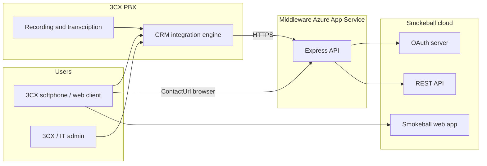

# Smokeball and 3CX Integration: Architecture

This document describes the technical design of the ITT middleware that connects **3CX Phone System** to **Smokeball** (Australian legal practice management). It is intended for developers, solution architects, and technical reviewers.

---

## 1. Problem and scope

### 1.1 Why middleware exists

3CX cannot integrate with Smokeball directly for three structural reasons:

| Constraint | Implication |
|------------|-------------|
| OAuth redirect URIs | Smokeball registers a fixed callback URL. 3CX always uses `https://<pbx-fqdn>/api/oauth2crm` during CRM authorization. |
| PBX-initiated API calls | 3CX holds refresh tokens and calls CRM endpoints server-side; the middleware must accept those calls and call Smokeball with the same tokens. |
| Contact search | Smokeball exposes contact search via the REST API (`Search` on `/contacts/`), not a phone-indexed lookup. The middleware implements phone and email matching logic 3CX expects. |

The middleware is a **stateless HTTP service** (Node.js / Express) deployed on a public HTTPS host (typically Azure App Service). It does not store firm data in a database; it proxies OAuth, translates 3CX CRM scenarios into Smokeball API calls, and optionally creates tasks and time entries from call and chat journals.

### 1.2 In scope

- OAuth 2.0 authorization code flow with PKCE (proxy or passthrough mode)
- Caller ID lookup by phone or email
- Free-text contact search from the 3CX client
- Browser contact card (`ContactUrl`) for answer pop
- Call journaling to Smokeball tasks (and optional time fees)
- Chat / SMS journaling to Smokeball tasks
- Operational dashboard (`/`, `/api/status`, `/api/logs`)

### 1.3 Out of scope

- Replacing Smokeball or 3CX administration UIs
- Storing call recordings or transcripts (3CX sends text in journal payloads; recordings stay on the PBX)
- Multi-tenant routing inside one deployment (production uses **one Web App per firm**; see [MULTI_FIRM_DEPLOYMENT.md](./MULTI_FIRM_DEPLOYMENT.md))
- Direct browser access to Smokeball contact URLs (API routes require Bearer tokens)

---

## 2. System context



**Trust boundaries**

- **3CX to middleware:** HTTPS from PBX to public middleware URL; Bearer access token on API routes (issued by Smokeball, held by 3CX).
- **Middleware to Smokeball:** `Authorization: Bearer` plus `x-api-key` on every API request.
- **Browser to middleware:** Contact open page is unauthenticated HTML served from an in-memory cache populated during lookup (no PII at rest on disk).

---

## 3. Runtime components

| Component | Location | Responsibility |
|-----------|----------|----------------|
| `server.js` | Entry | Express app, static dashboard, OAuth callback redirect to PBX, legacy `/lookup` and `/journal` forwards |
| `src/routes/3cx.js` | Routes | OAuth proxy, lookup, search, journal, chat-journal, contact open page |
| `src/services/smokeball.js` | Service | Smokeball HTTP client (contacts, staff, matters, tasks, fees) with retry |
| `src/services/journalProcessor.js` | Service | Map 3CX journal JSON to Smokeball tasks and optional fees |
| `src/utils/*` | Utilities | Phone normalization (AU), contact formatting for 3CX, staff/matter resolution, transcript formatting, journal AI field extraction |
| `3cx_smokeball_template_fixed.xml` | Artifact | 3CX CRM template (scenarios, OAuth, ReportCall, ReportChat) |
| `public/index.html` | UI | Simple health and log viewer |

There is **no persistent datastore**. Contact cache (`contactCache.js`) is an in-process TTL map used only for the contact open page and journal contact fallback by phone.

---

## 4. 3CX CRM template (logical contract)

Template **Version 7** (`SupportsTranscription="true"`) defines scenarios the PBX executes:

| Scenario ID | Type | Purpose |
|-------------|------|---------|
| `Auth` | REST | Refresh token exchange via middleware `/api/3cx/oauth2/token` |
| `OAuthGetAccessToken` | REST | Authorization code exchange |
| `Lookup` | REST GET | `?number=` phone lookup |
| `LookupByEmail` | REST GET | `?email=` email lookup |
| `SearchContacts` | REST GET | `?q=` free-text search |
| `ReportCall` | REST POST | Call journal to `/api/3cx/journal` |
| `ReportChat` | REST POST | Chat journal to `/api/3cx/chat-journal` |

**Caller ID rule:** 3CX requires the returned `PhoneMobile` value to **exactly match** the dialled number. The middleware sets `contacts.phone` to the trimmed dial string from the lookup query.

**Journal payload:** JSON `PostValues` include `Transcription`, `Summary`, `RecordUrl`, `RenderedJournal` (expanded call-type text), agent fields, and `ContactId` (`EntityId` from lookup).

---

## 5. Core data flows

### 5.1 OAuth proxy mode (default)

`SMOKEBALL_OAUTH_MODE=proxy`

1. 3CX opens `{PUBLIC_URL}/api/3cx/oauth2/authorize` with `redirect_uri=https://<pbx>/api/oauth2crm` and PKCE.
2. Middleware encodes `{ pbxRedirect, pbxState }` in base64 `state` and redirects to Smokeball with `redirect_uri={PUBLIC_URL}/auth/callback`.
3. User approves; Smokeball redirects to `/auth/callback?code&state`.
4. Middleware decodes `state` and redirects the browser to `https://<pbx>/api/oauth2crm?code&state`.
5. 3CX POSTs to `/api/3cx/oauth2/token`; middleware rewrites `redirect_uri` to the middleware callback for token exchange.
6. 3CX stores refresh token; subsequent CRM calls use access tokens.

Passthrough mode skips steps 2 to 4 rewriting and requires Smokeball to register the PBX callback URL directly.

### 5.2 Inbound call lookup

```
3CX --GET /api/3cx/lookup?number=... + Bearer--> Middleware
Middleware --GET /contacts/?Search=phone:*...--> Smokeball
Middleware --suffix match AU numbers locally--> best contact by lastUpdated
Middleware --JSON contacts[]--> 3CX (name, phones, EntityId, contactUrl)
```

Phone search uses `buildPhoneSearchTerms()` (AU `+61` / `0` variants). `contactCache` stores formatted contact for open page and journal fallback.

### 5.3 Call journal to Smokeball task

```
3CX --POST /api/3cx/journal + Bearer--> Middleware
  resolve staff (email, name, defaultStaffId)
  resolve contactId (payload or phone cache)
  optional skip (requireContact, requireMatter, skipMissed, createTasks)
  extract AI fields (Summary, Transcription, RenderedJournal)
  format speaker-labelled transcript
  resolve matter (Open/Pending first, then any)
  POST /tasks { staffId, matterId?, subject, note, duration? }
  optional POST /matters/{id}/fees (time entry)
```

Task `note` is capped at 3,000 characters (Smokeball limit) with AI content ordered first.

### 5.4 Chat journal

Same actor resolution as calls; task note contains `ChatMessages` thread. No automatic time fee unless extended in future.

---

## 6. Smokeball API usage

| Operation | Endpoint | When |
|-----------|----------|------|
| Search contacts | `GET /contacts/?Search=` | Lookup, search |
| Get contact | `GET /contacts/{id}` | Journal name resolution |
| Search staff | `GET /staff?Search=` | Journal staff match |
| List staff | `GET /staff` | Staff fallback |
| List matters | `GET /matters?ContactId=` | Matter linkage |
| Create task | `POST /tasks` | Call / chat journal |
| Create fee | `POST /matters/{matterId}/fees` | Optional time costing |

**Resilience:** `requestWithRetry` honors `429` and `5xx` with exponential backoff (`SMOKEBALL_MAX_RETRIES`, `SMOKEBALL_RETRY_BASE_DELAY_MS`).

**Recommended OAuth scopes:** `contacts/read`, `staff/read`, `matters/read`, `tasks/write`, `fees/write` (plus any firm policy requires).

---

## 7. Configuration model

All behavior is driven by **environment variables** (`src/config.js`). See [ADMINISTRATION.md](./ADMINISTRATION.md) for operational settings.

Journal flags are evaluated in `shouldSkipJournal()` before any Smokeball write.

---

## 8. Deployment architecture

| Layer | Typical choice |
|-------|----------------|
| Host | Azure App Service Linux, Node 20 LTS (one app per firm) |
| CI/CD | GitHub Actions matrix deploy from `deploy/firms.json` |
| Secrets | Azure Application Settings per firm (`deploy/firms/<id>.env`, gitignored) |
| Health | `GET /api/status` |
| Logs | Winston to stdout plus ring buffer exposed at `GET /api/logs` (CRM-related lines only) |

The PBX must reach the middleware over **HTTPS** on outbound connections. User browsers reach the middleware for OAuth callback and `ContactUrl`.

---

## 9. Security considerations

- **Secrets:** Client secret, API key, and refresh token (in 3CX) must be protected. Middleware holds only server-side env secrets.
- **Tokens:** Access tokens transit from 3CX to middleware on each CRM call; middleware does not persist tokens.
- **Contact open page:** Shows cached lookup data without Smokeball session; suitable for quick pop, not authoritative record.
- **No authentication on `/api/logs`:** Treat deployment URL as sensitive; restrict network or add front-door auth if required by policy.

---

## 10. Extension points

| Area | How to extend |
|------|----------------|
| Matter selection | Adjust `pickBestMatter()` in `matterLookup.js` |
| Staff matching | Extend `buildSearchAttempts()` in `staffLookup.js` |
| Journal filters | Env flags or new rules in `shouldSkipJournal()` |
| CRM template | New scenarios or PostValues in XML; bump `Version` |
| Alternate host | Same codebase; new App Service and env per client |

---

## 11. Related artifacts

- [ADMINISTRATION.md](./ADMINISTRATION.md): setup, operations, troubleshooting
- [README.md](../README.md): developer quick start and API table
- `3cx_smokeball_template_fixed.xml`: PBX integration definition
